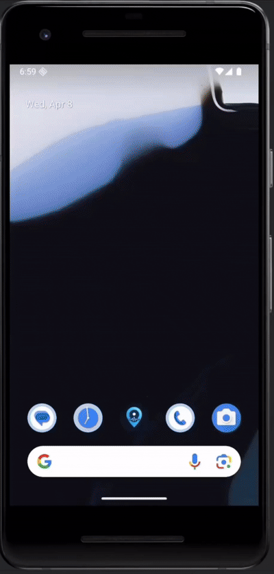
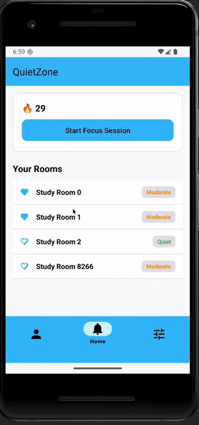
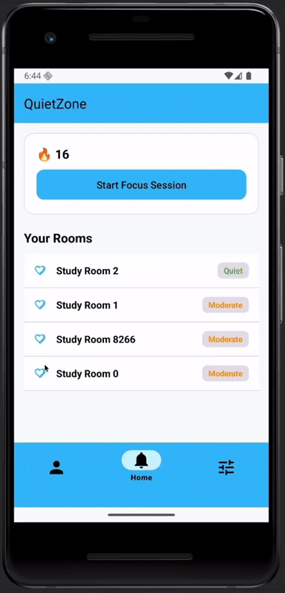
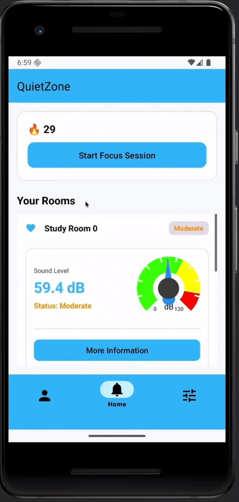
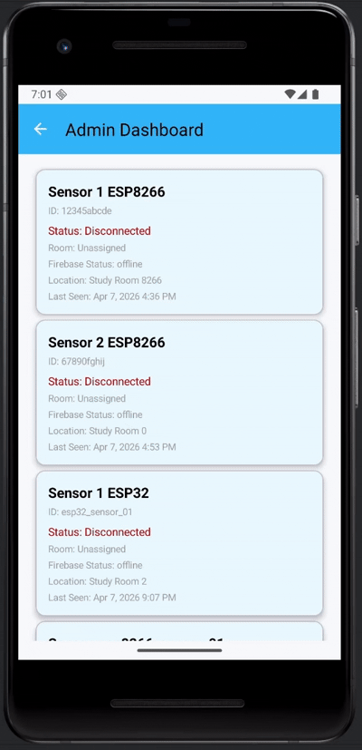
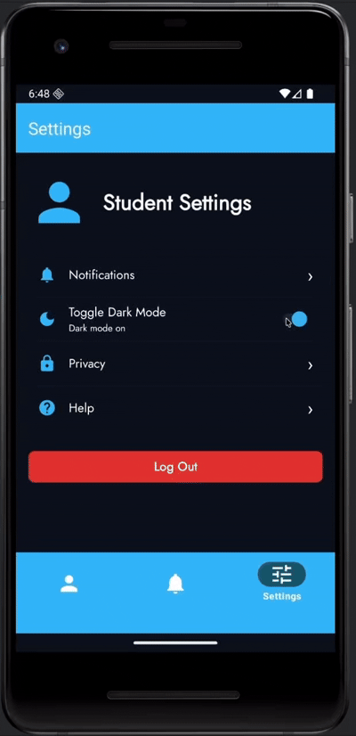

# QuietZone 

Semester-long group project for COEN-ELEC390 (Engineering Product Design) at Concordia University

## Overview

QuietZone is a real-time noise monitoring system designed to help users find quiet locations in various environments. Built with distributed sound sensors and IoT communication, it enables users to view live noise levels across monitored areas through an intuitive mobile interface, while providing administrators with comprehensive sensor management capabilities.



## Problem Statement

Finding quiet spaces in busy environments like libraries, study areas, or campuses can be challenging without real-time information about noise levels. Existing solutions often lack accessibility, real-time updates, or user-friendly interfaces. QuietZone aims to provide an accessible, scalable noise monitoring system that helps users make informed decisions about where to find peaceful environments for work, study, or relaxation.

## Key Features

### 1. Real-time Noise Monitoring




Users can browse study rooms and instantly see whether a space is quiet, moderate, or loud based on live sensor data.

### 2. Favorite Rooms



Users can save preferred study spaces and quickly access them at the top of the list.

### 3. Focus Session and Focus Streaks



Users can start a study timer inside the app and save completed sessions. The app tracks repeated use to encourage consistency.

### 4. Admin Dashboard



An admin-side interface supports sensor management and inactivity detection.

### 5. Dark Mode



Users can switch themes for comfort and accessibility


## Technology Stack

**Embedded Hardware:** ESP32 (Arduino Framework)  
**Sensors:** Sparkfun Sound Detector (dB measurement), LED Indicators  
**Communication:** WiFi for wireless data transmission  
**Central Hub:** Raspberry Pi (Linux-based)  
**Database:** Firebase (Cloud database)  
**Mobile Platform:** Android (API Level 24+)  
**Development Tools:** PlatformIO, Android Studio, Gradle  
**Version Control:** GitHub

## Development Process

This project follows an Agile Scrum methodology with iterative development cycles called sprints.

**Sprint 1 Goal:** Configure sound sensor and Raspberry Pi, establish basic communication with database, implement basic mobile app skeleton, and implement initial Admin functionality

**Sprint 2 Goal:** Implement live noise display for users, noise categorization system, and inactivity detection for sensors

**Version Control & Collaboration:** Managed using GitHub with structured repositories and sprint-based development

## Team Members

| Name           | Student ID | Role        |
| -------------- | ---------- | ----------- |
| Angad Singh    | 4028556    | Team Member |
| Angad Malhotra | 40133666   | Team Member |
| Ethan Lee      | 40207989   | Team Member |
| Omar Bendjama  | 40281483   | Team Member |
| Tonny Zhao     | 40283194   | Team Member |

## Project Repository

**GitHub Repository:** [COEN-ELEC290-QuietZone/QuietZone](https://github.com/COEN-ELEC290-QuietZone/QuietZone)

## Build and Run (Android Emulator)

Use the following commands in PowerShell from the `App` folder:

```powershell
cd C:\Users\super\Documents\VScodeProject\COEN-ELEC390\QuietZone_project\App
```

1. Build debug APK

```powershell
.\gradlew.bat assembleDebug
```

2. Install on running emulator

```powershell
.\gradlew.bat installDebug
```

3. Launch app manually (optional)

```powershell
adb shell am start -n com.example.quietzone_app/.MainActivity
```

Useful commands:

```powershell
# Clean and rebuild
.\gradlew.bat clean assembleDebug

# List connected devices/emulators
adb devices

# Reinstall from scratch
adb uninstall com.example.quietzone_app
.\gradlew.bat installDebug
```

## License

This project is developed as part of the COEN-ELEC390 course and is intended for educational purposes.

